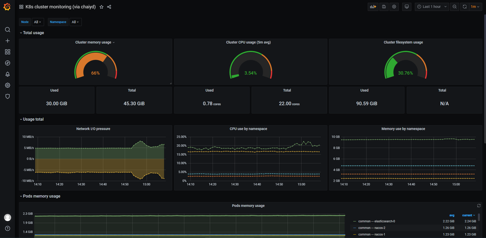
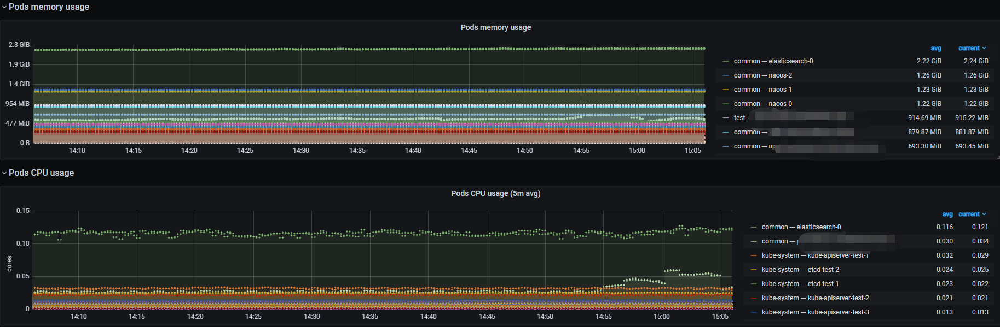

# prometheus
* 存放prometheus  metrics相关

## metrics
* 用于获取容器各项指标
* metrics-server 与 kube-state-metrics区别请参考k8s文档，这里不做赘述。
* https://github.com/kubernetes-sigs/metrics-server.git
* https://github.com/kubernetes/kube-state-metrics.git

## grafana模板
* https://grafana.com/grafana/dashboards/12870
* 下列版本经过测试，其他版本请自行测试
```
- update kubernetes 1.21.0
- node-exporter version v1.1.2
- prometheus version v2.27.1
- grafana version 8.0.1
```





